# 🧬 Parkinson’s Disease Detection using Keystroke Dynamics
A machine learning project that predicts early-stage Parkinson's Disease using typing behaviour (keystroke dynamics), enabling a non-invasive and accessible diagnostic approach.

---

## 📄 Abstract

Parkinson’s Disease (PD) is a progressive neurological disorder that affects motor function and quality of life. Early diagnosis is crucial, but traditional methods can be subjective and may fail to detect the disease at an early stage.

This project investigates whether keystroke dynamics—such as hold time and inter-key latency—can serve as a non-invasive biomarker for early Parkinson’s detection. Using machine learning techniques, the study identifies subtle typing patterns associated with PD.

Recursive Feature Elimination (RFE) was applied to select the most relevant features, while class imbalance was addressed using SMOTE. Multiple models were trained and evaluated, including Random Forest and Logistic Regression.

The results demonstrate strong predictive performance, with:
* Random Forest accuracy: 96.46%
* Logistic Regression accuracy: 94.96%

These findings highlight the potential of combining machine learning with behavioural data to enable early, accessible, and non-invasive diagnosis of Parkinson’s Disease.

---

## 📌 Overview

This project explores how subtle motor impairments caused by Parkinson's Disease can be detected through everyday typing patterns. Traditional diagnostic methods are often subjective and may lead to delayed or incorrect diagnosis.By analysing keystroke timing features such as hold time, latency, and flight time, the model learns to distinguish between healthy individuals and those with Parkinson's.

The project implements a complete end-to-end machine learning pipeline, including:
* Data preprocessing and cleaning
* Feature engineering and selection
* Class imbalance handling
* Model training and evaluation

---

## 🚀 Key Highlights

🧬 Healthcare-focused ML application (early disease detection)

⌨️ Uses keystroke dynamics (non-invasive biomarker)

🧠 Implements Recursive Feature Elimination (RFE)

⚖️ Handles class imbalance using SMOTE

🔒 Prevents data leakage with GroupShuffleSplit (user-level split)

📊 Multiple models tested: Random Forest, Logistic Regression, SVM, XGBoost

📈 Strong performance with robust evaluation metrics

---

## 🎯 Objective

* Identify early signs of Parkinson’s Disease using typing behaviour
* Apply feature selection to improve model performance
* Compare machine learning models for accurate classification

---

## 📊 Dataset

* Source: PhysioNet (Tappy Keystroke Dataset)
* Includes:
  * Keystroke data: Hold time, latency time, flight time
  * User metadata: Age, gender, diagnosis status, medication, etc.
  
* Data was merged from:
  * Tappy keystroke dataset
  * User clinical information files

---

## ⚙️ Methodology

### 1. Data Preprocessing

* Merged keystroke and user datasets (~9M rows initially)
* Removed unmatched users and duplicates
* Handled missing values using median imputation
* Removed outliers using IQR method
* Applied Min-Max scaling

### 2. Data Filtering

* Users with ≥ 2000 keystrokes retained
* Focused on early-stage Parkinson’s (Mild/Medium)
* Excluded patients on Levodopa to reduce bias

### 3. Train-Test Split

* Used GroupShuffleSplit to split by user
* Ensured no user overlap → prevents data leakage

### 4. Feature Engineering

* Created:
  * Age
  * Age_Group (>=60)
  
* One-hot encoded:
  * Hand, Direction, Sided
  
* Converted categorical variables to numerical
* Removed irrelevant features

### 5. Feature Selection

* Applied Recursive Feature Elimination (RFE)
* Selected most information features to improve model performance

### 6. Handling Class Imbalance

* Applied SMOTE (Synthetic Minority Over-sampling Technique) to balance classes in training data

### 7. Machine Learning Models

* Random Forest
* Logistic Regression

---

## 📈 Results

| Model               | Accuracy |
| ------------------- | -------- |
| Random Forest       | 96.46%   |
| Logistic Regression | 94.96%   |

* Feature selection + SMOTE significantly improved performance
* Random Forest achieved the best results

---

## 📈 Visualisations

The project includes several visualisations to support model performance, data preprocessing decisions, and feature analysis:

### 📉 Dataset Filtering Impact

  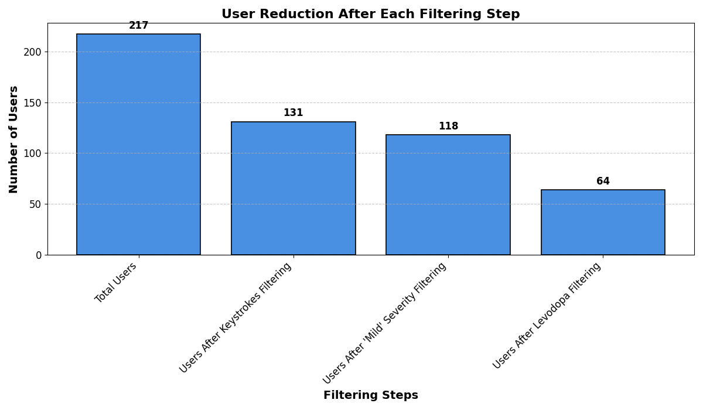

This visualisatoin shows how the dataset was refined through successive filtering steps.
* Initial dataset: 217 users
* After keystroke filtering: 131 users
* After focusing on mild severity: 118 users
* Final dataset (excluding Levodopa): 64 users

This process ensures:
* Sufficient typing data per user
* Focus on early-stage Parkinson's detection
* Reduced bias from medication effects

---

### 👥 Train–Test Split Integrity

  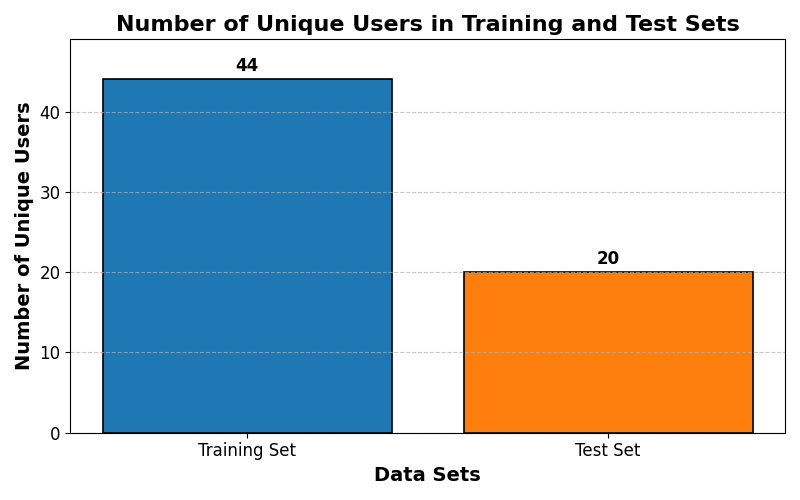

This chart shows the number of unique users in the training and test sets.
* Training set: 44 users
* Test set: 20 users

A user-level split (GroupShuffleSplit) was applied to ensure:
* No overlap between users
* Prevention of data leakage
* More reliable model evaluation

---

### 📈 Age Distribution Analysis

  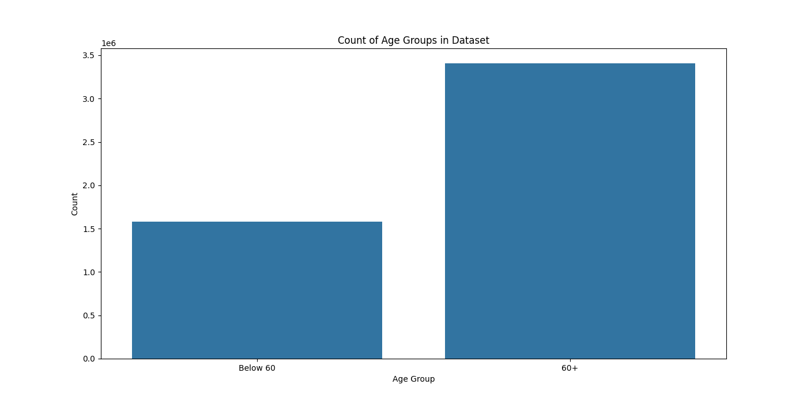

The age distribution highlights the demographic structure of the dataset.
* A clear separation is introduced at age 60, used to create the Age_Group feature
* Majority of participants fall into the 60+ category, aligning with known Parkinson's prevalence trends

This supports the inclusion of age-relatged features in the model.

---

### 📊 Age Group Distribution

  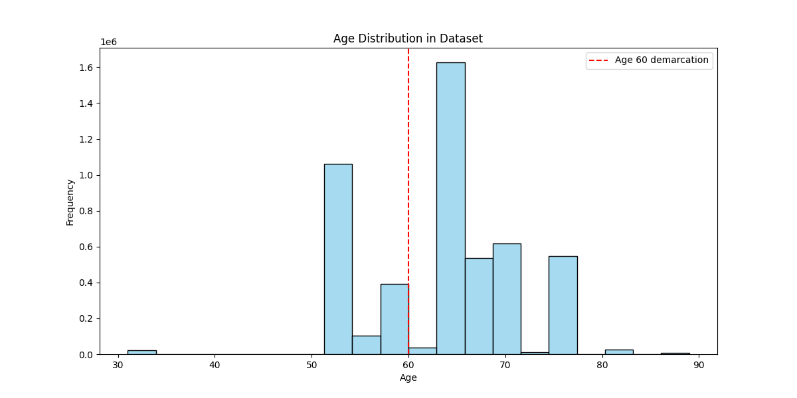

This plot shows the distribution of users across age groups:
* Below 60
* 60 and above

The imbalance between groups reflects real-world data and reinforces the importance of incorporating demographic features into the model.

---

### 🚻 Gender Distribution (Train vs Test)

  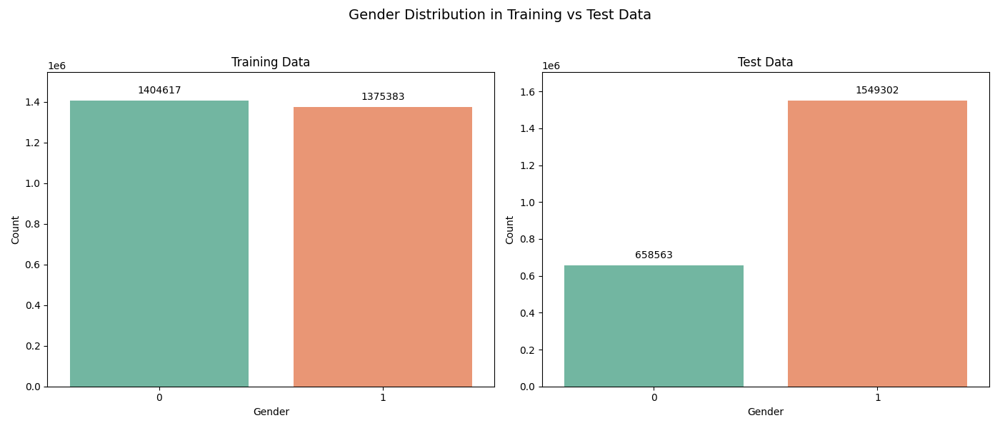

This visualisation compares gender distribution across training and test datasets.
* Both datasets maintain a balanced representation
* Ensures fairness and consistency in model evaluation
* Reduces risk of bias related to gender imbalance

---

## 🤖 Model Performance & Evaluation

### 🔗 Feature Correlation Analysis

  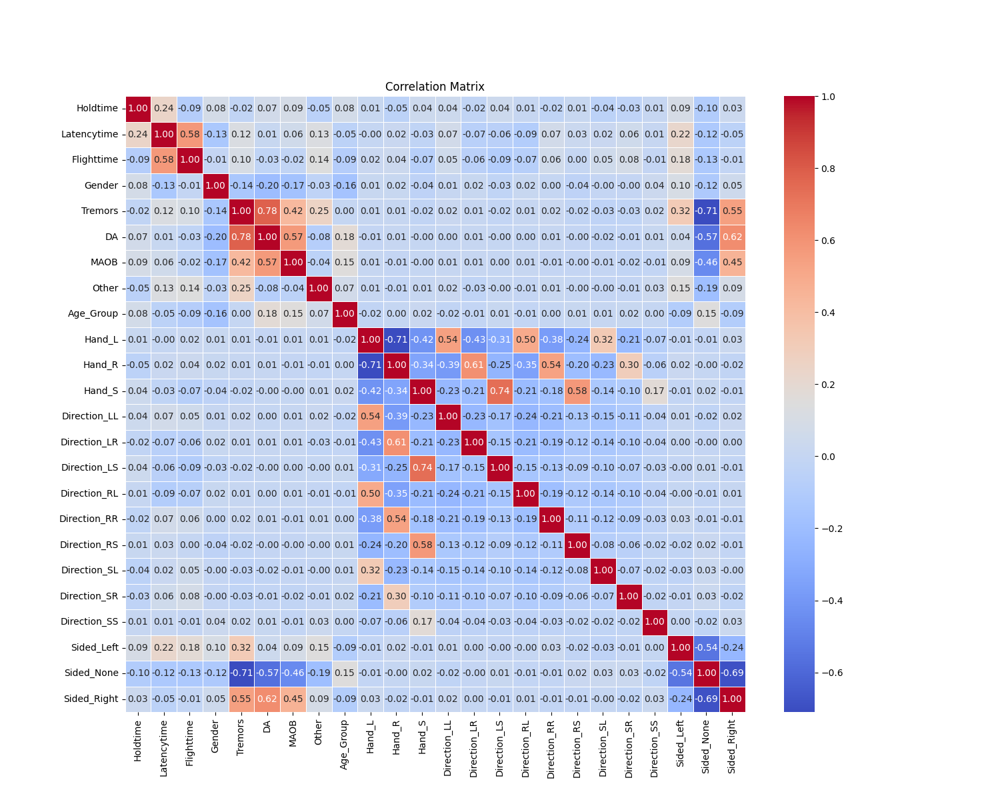

The correlation matrix provides insight into relationships between features.
* Keystroke features (hold time, latency, flight time) show moderate relationships, including complementary information
* Clinical features such as tremors, medication usage (DA, MAOB) exhibit stronger correlations 
* Low multicollinearity across most features supports stable model training

This analysis helps ensure that selected features contribute meaningful and non-redundant information.

---

### 🔄 Class Imbalance Handling (SMOTE)

  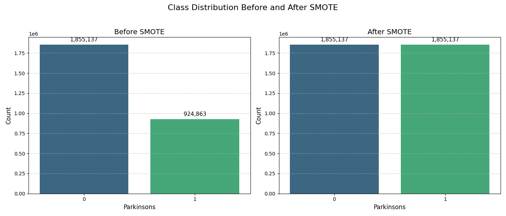

This visualisation compares the class distribution before and after applying SMOTE. Initially, the dataset was highly imbalanced, with significantly fewer Parkinson’s cases.

After applying SMOTE, both classes are balanced, enabling the model to learn more effectively and reducing bias toward the majority class.

---

### 🎯 Feature Importance (After RFE)

  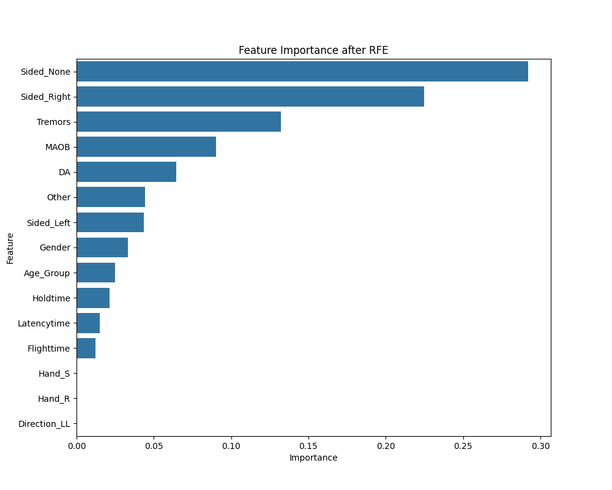

Recursive Feature Elimination (RFE) identified the most influential features:
* Sidedness (Left/Right/None) and tremors are the strongest predictors
* Medication-related features (DA, MAOB) also contribute significantly
* Keystroke dynamics (hold time, latency, flight time) provide additional predictive value

This demonstrates that combining behavioural + clinical features improves model effectiveness.

---

### 📊 Random Forest Performance (With SMOTE)

  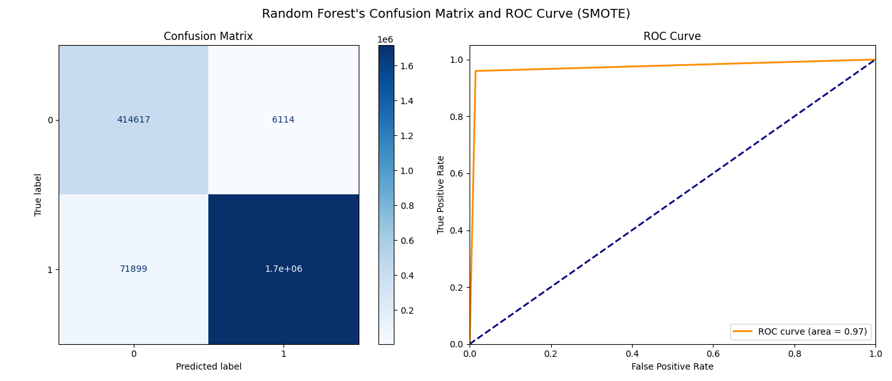

The Random Forest model trained with SMOTE shows strong classification of performance:
* ROC-AUC score of approximately 0.97, indicating excellent class separability
* High true positive rate with minimal false positives
* Confusion matrix shows strong detection of both Parkinson's and healthy cases

This highlights the effectiveness of class balancing using SMOTE.

---

### ⚠️ Random Forest Performance (Without SMOTE)

  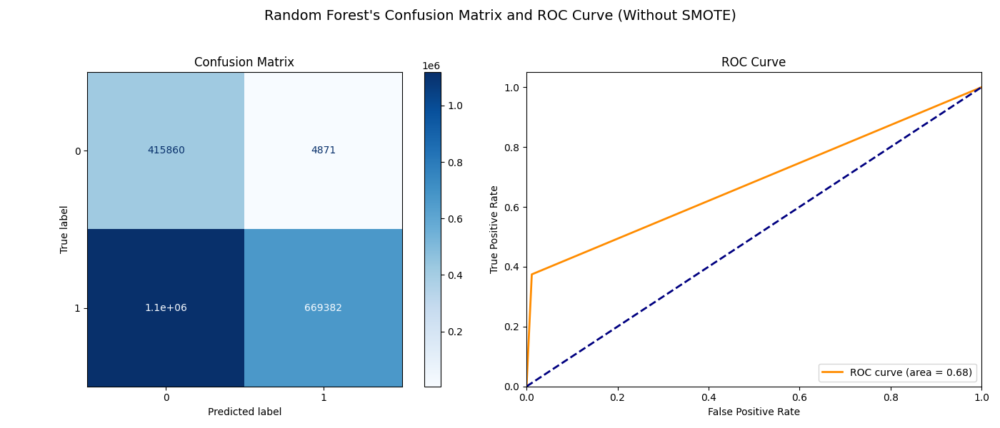

Without SMOTE, model performance drops significantly:
* ROC-AUC decreases to approximately 0.68
* Model becomes biased toward the majority class
* Poor recall for Parkinson's cases

This demonstrates the critical importance of handling class imbalance in medical datasets.

---

### 📊 Model Comparison

  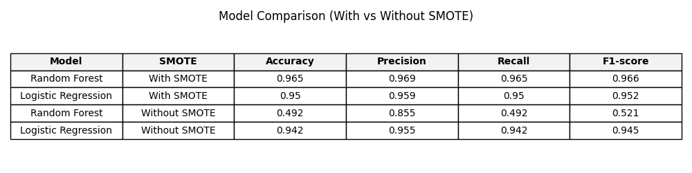

Performance comparison across models:
* Random Forest (with SMOTE) achieved the best performance
  * Accuracy: 96.5%
  * F1-score: 0.966
* Logistic Regression also performed strongly with SMOTE
* Without SMOTE, Random Forest performance dropped drastically

👉 Key takeaway:
* Class imbalance handling + feature selection = major performance improvement

---

## 🛠️ Tech Stack

* Python
* Scikit-learn
* Pandas, NumPy
* Imbalanced-learn (SMOTE)
* Matplotlib, Seaborn

---

## 🚀 Future Improvements

* Deep learning models (LSTM for temporal typing patterns)
* Real-time detection system
* Web/app deployment for clinical use
* Larger and more diverse datasets

---

## 📌 Author

Thiha Kyaw Zaw

MSc Data Science - University of Sheffield
